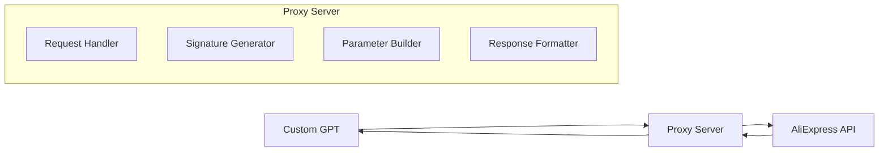

# Design Document

## Overview

The AliExpress Affiliate API Proxy is a lightweight Node.js server that acts as a secure intermediary between a custom GPT and the AliExpress Affiliate API. The proxy handles the complex SHA256 signature generation required by AliExpress while providing a simple REST API interface that can be easily consumed by OpenAI's GPT platform.

The system follows a straightforward request-response pattern where the GPT sends simplified requests to our proxy, which then authenticates, signs, and forwards them to AliExpress, returning the results in a clean JSON format.

## Architecture

### High-Level Architecture



### Technology Stack

- **Runtime**: Node.js 18+ (for modern JavaScript features and stability)
- **Framework**: Express.js (lightweight, well-documented, GPT-friendly)
- **Deployment**: Vercel (free tier, excellent for serverless functions, automatic HTTPS)
- **Security**: Built-in rate limiting and input validation
- **Documentation**: OpenAPI 3.1.0 specification served at `/docs`

### Request Flow

1. Custom GPT sends HTTP request to proxy endpoint
2. Proxy validates and sanitizes input parameters
3. Proxy builds complete AliExpress API parameter set
4. Proxy generates SHA256 signature using app secret
5. Proxy forwards signed request to AliExpress API
6. Proxy receives and validates AliExpress response
7. Proxy returns formatted JSON response to GPT

## Components and Interfaces

### Core Components

#### 1. Request Handler (`/api/aliexpress`)
- **Purpose**: Main endpoint that accepts GPT requests
- **Methods**: POST (primary), GET (for simple queries)
- **Input**: JSON payload with search parameters
- **Output**: Formatted AliExpress API response

#### 2. Signature Generator
- **Purpose**: Creates SHA256 signatures for AliExpress authentication
- **Input**: Sorted parameter string + app secret
- **Output**: Hexadecimal signature string
- **Algorithm**: SHA256(sorted_params + app_secret)

#### 3. Parameter Builder
- **Purpose**: Constructs complete AliExpress API parameter sets
- **Functions**:
  - Adds required system parameters (app_key, timestamp, format, etc.)
  - Merges user parameters with system parameters
  - Sorts parameters alphabetically for signature generation

#### 4. Response Formatter
- **Purpose**: Standardizes API responses for GPT consumption
- **Functions**:
  - Extracts relevant data from AliExpress responses
  - Handles error responses consistently
  - Adds metadata for debugging

### API Interface Design

#### Primary Endpoint: `/api/aliexpress`

**Request Format:**
```json
{
  "method": "aliexpress.affiliate.product.query",
  "keywords": "wireless headphones",
  "category_ids": "509,708",
  "page_no": 1,
  "page_size": 20,
  "target_currency": "USD",
  "target_language": "EN",
  "sort": "SALE_PRICE_ASC"
}
```

**Response Format:**
```json
{
  "success": true,
  "data": {
    "products": [...],
    "total_record_count": 1500
  },
  "metadata": {
    "request_id": "uuid",
    "timestamp": "2024-01-01T00:00:00Z",
    "processing_time_ms": 250
  }
}
```

#### Health Check: `/health`
- Simple endpoint for monitoring service availability
- Returns service status and version information

#### Documentation: `/docs`
- Serves OpenAPI 3.1.0 specification
- Interactive API documentation for development

## Data Models

### Request Models

#### AliExpressRequest
```typescript
interface AliExpressRequest {
  method: string;                    // AliExpress API method name
  keywords?: string;                 // Search keywords
  category_ids?: string;             // Comma-separated category IDs
  page_no?: number;                  // Page number (default: 1)
  page_size?: number;                // Results per page (default: 20)
  target_currency?: string;          // Currency code (default: USD)
  target_language?: string;          // Language code (default: EN)
  sort?: string;                     // Sort order
  [key: string]: any;               // Additional parameters
}
```

#### SystemParameters
```typescript
interface SystemParameters {
  app_key: string;                   // AliExpress app key
  timestamp: string;                 // Unix timestamp
  format: string;                    // Response format (json)
  v: string;                         // API version
  sign_method: string;               // Signature method (sha256)
  sign: string;                      // Generated signature
}
```

### Response Models

#### ProxyResponse
```typescript
interface ProxyResponse {
  success: boolean;
  data?: any;                        // AliExpress API response data
  error?: {
    code: string;
    message: string;
    details?: any;
  };
  metadata: {
    request_id: string;
    timestamp: string;
    processing_time_ms: number;
  };
}
```

## Error Handling

### Error Categories

1. **Client Errors (4xx)**
   - Invalid parameters
   - Missing required fields
   - Malformed requests

2. **Server Errors (5xx)**
   - AliExpress API failures
   - Signature generation errors
   - Network timeouts

3. **Rate Limiting (429)**
   - Too many requests from same source
   - Configurable limits per endpoint

### Error Response Format

```json
{
  "success": false,
  "error": {
    "code": "INVALID_PARAMETERS",
    "message": "Missing required parameter: method",
    "details": {
      "missing_fields": ["method"],
      "provided_fields": ["keywords", "page_no"]
    }
  },
  "metadata": {
    "request_id": "uuid",
    "timestamp": "2024-01-01T00:00:00Z",
    "processing_time_ms": 15
  }
}
```

### Retry Strategy

- Automatic retry for network timeouts (max 2 retries)
- Exponential backoff for rate-limited requests
- Circuit breaker pattern for AliExpress API failures

## Security Considerations

### Environment Variables
- `ALIEXPRESS_APP_KEY`: Public app key from AliExpress
- `ALIEXPRESS_APP_SECRET`: Private secret for signature generation
- `API_TOKEN`: Optional token for proxy authentication
- `RATE_LIMIT_MAX`: Maximum requests per window
- `RATE_LIMIT_WINDOW`: Time window for rate limiting

### Input Validation
- Parameter sanitization to prevent injection attacks
- Request size limits to prevent DoS attacks
- Whitelist of allowed AliExpress API methods

### Rate Limiting
- 100 requests per minute per IP address (configurable)
- Burst allowance of 10 requests
- Headers to inform clients of rate limit status

## Testing Strategy

### Unit Tests
- Signature generation algorithm
- Parameter building and sorting
- Response formatting functions
- Error handling scenarios

### Integration Tests
- End-to-end request flow with mock AliExpress API
- Error response handling
- Rate limiting behavior

### Manual Testing
- OpenAPI specification validation
- Custom GPT integration testing
- Performance testing with concurrent requests

### Deployment Testing
- Vercel deployment validation
- Environment variable configuration
- HTTPS certificate verification
- CORS header validation

## Deployment Configuration

### Vercel Configuration (`vercel.json`)
```json
{
  "version": 2,
  "functions": {
    "api/**/*.js": {
      "runtime": "nodejs18.x"
    }
  },
  "env": {
    "ALIEXPRESS_APP_KEY": "@aliexpress-app-key",
    "ALIEXPRESS_APP_SECRET": "@aliexpress-app-secret"
  }
}
```

### Environment Setup
- Vercel environment variables for secrets
- Automatic HTTPS and CDN distribution
- Serverless function scaling
- Built-in monitoring and logging

## Performance Considerations

- Response caching for identical requests (5-minute TTL)
- Connection pooling for AliExpress API requests
- Gzip compression for large responses
- Request timeout of 30 seconds
- Memory-efficient JSON parsing

## Monitoring and Logging

- Request/response logging (excluding sensitive data)
- Performance metrics (response times, error rates)
- Rate limiting statistics
- AliExpress API health monitoring