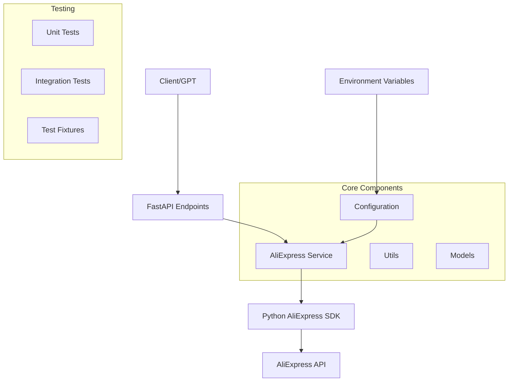

# Design Document

## Overview

The AliExpress Python Refactor transforms the existing Node.js proxy into a clean, modular Python application using the official python-aliexpress-api SDK. The refactored system maintains all existing functionality while providing a more maintainable architecture that leverages the official SDK's capabilities for authentication, request signing, and data retrieval.

The design follows Python best practices with clear separation of concerns, dependency injection for testability, and optional FastAPI endpoints for GPT integration. The core functionality remains the same - retrieving categories and product data from AliExpress - but with improved code organization and reliability.

## Architecture

### High-Level Architecture



### Technology Stack

- **Language**: Python 3.8+ (for modern features and SDK compatibility)
- **SDK**: python-aliexpress-api (official SDK from sergioteula)
- **Web Framework**: FastAPI (optional, for API endpoints)
- **Configuration**: python-dotenv for environment variable management
- **Testing**: pytest with fixtures and mocking capabilities
- **Documentation**: Sphinx or built-in docstrings
- **Dependency Management**: pip with requirements.txt

### Project Structure

```
aliexpress-python-refactor/
├── src/
│   ├── __init__.py
│   ├── services/
│   │   ├── __init__.py
│   │   └── aliexpress_service.py
│   ├── utils/
│   │   ├── __init__.py
│   │   ├── config.py
│   │   └── response_formatter.py
│   ├── models/
│   │   ├── __init__.py
│   │   └── responses.py
│   └── api/
│       ├── __init__.py
│       ├── main.py
│       └── endpoints/
│           ├── __init__.py
│           └── categories.py
├── tests/
│   ├── __init__.py
│   ├── unit/
│   │   ├── test_aliexpress_service.py
│   │   └── test_config.py
│   ├── integration/
│   │   └── test_api_endpoints.py
│   └── fixtures/
│       └── mock_data.py
├── scripts/
│   └── demo.py
├── .env.example
├── .env
├── requirements.txt
├── requirements-dev.txt
├── README.md
└── setup.py
```

## Components and Interfaces

### Core Components

#### 1. AliExpress Service (`src/services/aliexpress_service.py`)

**Purpose**: Main service class that wraps the python-aliexpress-api SDK

**Key Methods**:
```python
class AliExpressService:
    def __init__(self, config: Config)
    def get_parent_categories(self) -> List[CategoryResponse]
    def get_child_categories(self, parent_id: str) -> List[CategoryResponse]
    def search_products(self, **kwargs) -> ProductSearchResponse
    def get_product_details(self, product_id: str) -> ProductResponse
```

**Features**:
- Handles SDK initialization with configuration
- Provides consistent error handling and logging
- Returns structured response objects
- Supports dependency injection for testing

#### 2. Configuration Management (`src/utils/config.py`)

**Purpose**: Centralized configuration loading and validation

**Key Features**:
```python
class Config:
    def __init__(self)
    def load_from_env(self) -> None
    def validate(self) -> None
    
    # Properties
    app_key: str
    app_secret: str
    tracking_id: str
    language: str
    currency: str
```

**Validation**:
- Ensures all required environment variables are present
- Provides sensible defaults for optional settings
- Raises clear errors for missing configuration

#### 3. Response Models (`src/models/responses.py`)

**Purpose**: Structured data models for API responses

**Key Models**:
```python
@dataclass
class CategoryResponse:
    category_id: str
    category_name: str
    parent_id: Optional[str] = None

@dataclass
class ProductResponse:
    product_id: str
    product_title: str
    product_url: str
    price: str
    currency: str
    
@dataclass
class ServiceResponse:
    success: bool
    data: Any
    error: Optional[str] = None
    metadata: Optional[Dict] = None
```

#### 4. FastAPI Endpoints (Optional - `src/api/`)

**Purpose**: REST API endpoints for external consumption

**Endpoints**:
- `GET /categories` - Get parent categories
- `GET /categories/{parent_id}/children` - Get child categories
- `POST /products/search` - Search products
- `GET /health` - Health check
- `GET /docs` - OpenAPI documentation

### Integration Patterns

#### SDK Integration
```python
# Clean wrapper around the official SDK
from aliexpress_api import AliexpressApi, models

class AliExpressService:
    def __init__(self, config: Config):
        self.api = AliexpressApi(
            key=config.app_key,
            secret=config.app_secret,
            language=getattr(models.Language, config.language),
            currency=getattr(models.Currency, config.currency),
            tracking_id=config.tracking_id
        )
    
    def get_parent_categories(self) -> List[CategoryResponse]:
        try:
            categories = self.api.get_parent_categories()
            return [
                CategoryResponse(
                    category_id=cat.category_id,
                    category_name=cat.category_name
                )
                for cat in categories
            ]
        except Exception as e:
            logger.error(f"Failed to get parent categories: {e}")
            raise ServiceException(f"Category retrieval failed: {e}")
```

## Data Models

### Configuration Model
```python
@dataclass
class Config:
    app_key: str
    app_secret: str
    tracking_id: str
    language: str = "EN"
    currency: str = "USD"
    
    @classmethod
    def from_env(cls) -> 'Config':
        load_dotenv()
        return cls(
            app_key=os.getenv('ALIEXPRESS_APP_KEY'),
            app_secret=os.getenv('ALIEXPRESS_APP_SECRET'),
            tracking_id=os.getenv('ALIEXPRESS_TRACKING_ID'),
            language=os.getenv('ALIEXPRESS_LANGUAGE', 'EN'),
            currency=os.getenv('ALIEXPRESS_CURRENCY', 'USD')
        )
```

### Response Models
```python
@dataclass
class CategoryResponse:
    category_id: str
    category_name: str
    parent_id: Optional[str] = None
    
    def to_dict(self) -> Dict:
        return asdict(self)

@dataclass
class ServiceResponse:
    success: bool
    data: Any = None
    error: Optional[str] = None
    metadata: Optional[Dict] = None
    
    @classmethod
    def success_response(cls, data: Any, metadata: Dict = None) -> 'ServiceResponse':
        return cls(success=True, data=data, metadata=metadata)
    
    @classmethod
    def error_response(cls, error: str, metadata: Dict = None) -> 'ServiceResponse':
        return cls(success=False, error=error, metadata=metadata)
```

## Error Handling

### Exception Hierarchy
```python
class AliExpressServiceException(Exception):
    """Base exception for AliExpress service errors"""
    pass

class ConfigurationError(AliExpressServiceException):
    """Raised when configuration is invalid or missing"""
    pass

class APIError(AliExpressServiceException):
    """Raised when AliExpress API calls fail"""
    pass

class ValidationError(AliExpressServiceException):
    """Raised when input validation fails"""
    pass
```

### Error Handling Strategy
- Wrap SDK exceptions in service-specific exceptions
- Provide meaningful error messages for debugging
- Log errors with appropriate levels (ERROR, WARNING, INFO)
- Return structured error responses for API endpoints
- Implement retry logic for transient failures

### Logging Configuration
```python
import logging

logging.basicConfig(
    level=logging.INFO,
    format='%(asctime)s - %(name)s - %(levelname)s - %(message)s',
    handlers=[
        logging.FileHandler('aliexpress_service.log'),
        logging.StreamHandler()
    ]
)

logger = logging.getLogger(__name__)
```

## Testing Strategy

### Unit Testing
- **Service Layer**: Mock the SDK to test service logic
- **Configuration**: Test environment variable loading and validation
- **Response Models**: Test data serialization and validation
- **Utilities**: Test helper functions and formatters

### Integration Testing
- **SDK Integration**: Test actual SDK calls with test credentials
- **End-to-End**: Test complete workflows from configuration to response
- **API Endpoints**: Test FastAPI endpoints with test client

### Test Structure
```python
# tests/unit/test_aliexpress_service.py
import pytest
from unittest.mock import Mock, patch
from src.services.aliexpress_service import AliExpressService

class TestAliExpressService:
    @pytest.fixture
    def mock_config(self):
        return Mock(
            app_key="test_key",
            app_secret="test_secret",
            tracking_id="test_tracking",
            language="EN",
            currency="USD"
        )
    
    @patch('src.services.aliexpress_service.AliexpressApi')
    def test_get_parent_categories_success(self, mock_api, mock_config):
        # Test implementation
        pass
```

### Test Fixtures
```python
# tests/fixtures/mock_data.py
MOCK_PARENT_CATEGORIES = [
    Mock(category_id="1", category_name="Electronics"),
    Mock(category_id="2", category_name="Fashion"),
]

MOCK_CHILD_CATEGORIES = [
    Mock(category_id="101", category_name="Smartphones"),
    Mock(category_id="102", category_name="Laptops"),
]
```

## Deployment and Environment

### Environment Variables
```bash
# .env.example
ALIEXPRESS_APP_KEY=your_app_key_here
ALIEXPRESS_APP_SECRET=your_app_secret_here
ALIEXPRESS_TRACKING_ID=your_tracking_id_here
ALIEXPRESS_LANGUAGE=EN
ALIEXPRESS_CURRENCY=USD

# Optional API settings
API_HOST=0.0.0.0
API_PORT=8000
LOG_LEVEL=INFO
```

### Dependencies
```txt
# requirements.txt
python-aliexpress-api>=1.0.0
python-dotenv>=1.0.0
fastapi>=0.100.0
uvicorn>=0.20.0
pydantic>=2.0.0

# requirements-dev.txt
pytest>=7.0.0
pytest-asyncio>=0.21.0
pytest-mock>=3.10.0
black>=23.0.0
flake8>=6.0.0
mypy>=1.0.0
```

### Docker Support (Optional)
```dockerfile
FROM python:3.11-slim

WORKDIR /app
COPY requirements.txt .
RUN pip install -r requirements.txt

COPY src/ ./src/
COPY .env .env

CMD ["python", "-m", "src.api.main"]
```

## Migration Strategy

### Phase 1: Core Service Implementation
1. Set up Python project structure
2. Implement configuration management
3. Create AliExpress service with SDK integration
4. Add basic error handling and logging

### Phase 2: Testing and Validation
1. Implement unit tests for service layer
2. Add integration tests with real API calls
3. Create test fixtures and mock data
4. Validate against existing functionality

### Phase 3: API Layer (Optional)
1. Implement FastAPI endpoints
2. Add request/response validation
3. Include OpenAPI documentation
4. Add health checks and monitoring

### Phase 4: Documentation and Deployment
1. Create comprehensive README
2. Add code documentation and examples
3. Set up deployment configuration
4. Create migration guide from Node.js version

## Performance Considerations

- **Connection Pooling**: Leverage SDK's built-in connection management
- **Caching**: Implement response caching for frequently accessed data
- **Async Support**: Use FastAPI's async capabilities for concurrent requests
- **Rate Limiting**: Respect AliExpress API rate limits
- **Memory Management**: Efficient handling of large product datasets

## Security Considerations

- **Environment Variables**: Never commit secrets to version control
- **Input Validation**: Validate all inputs before processing
- **Error Messages**: Don't expose sensitive information in error responses
- **Logging**: Avoid logging sensitive data like API secrets
- **Dependencies**: Keep SDK and dependencies updated for security patches