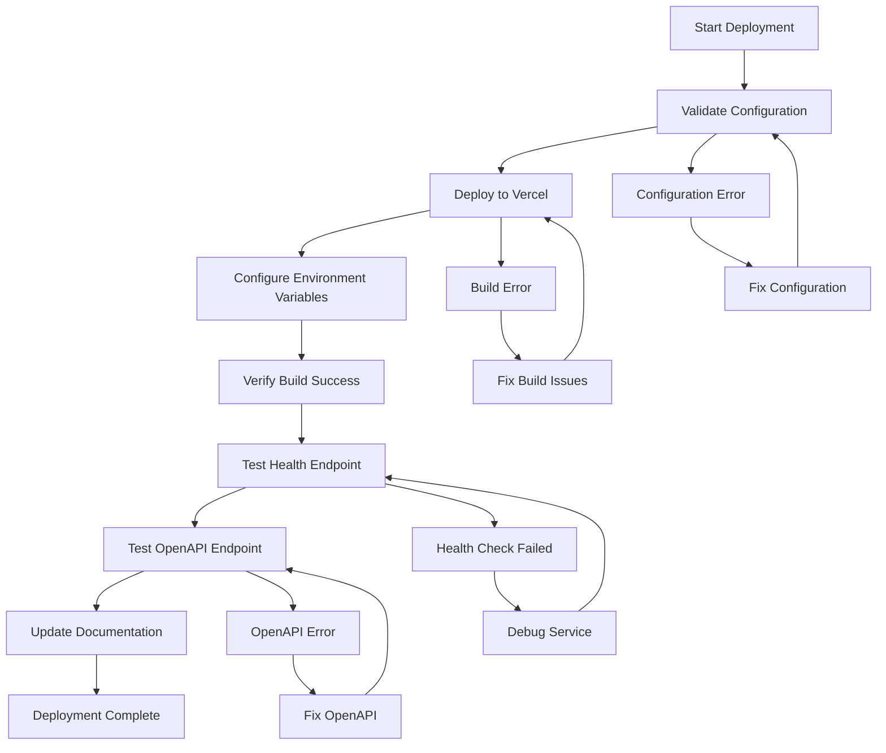

# Design Document

## Overview

This design outlines the deployment architecture and process for deploying the AliStach-V1 AliExpress API Proxy to Vercel's serverless platform. The deployment will transform the FastAPI application into a production-ready service accessible via a public URL, configured with proper environment variables and security settings for GPT Actions integration.

## Architecture

### Deployment Platform
- **Platform**: Vercel Serverless Functions
- **Runtime**: Python 3.11 with @vercel/python builder
- **Entry Point**: `src/api/main.py` (FastAPI application)
- **Function Timeout**: 30 seconds maximum execution time
- **Auto-scaling**: Serverless functions scale automatically based on demand

### Application Structure
```
Production Deployment
├── Vercel Function (src/api/main.py)
│   ├── FastAPI Application
│   ├── Security Middleware
│   ├── CORS Configuration
│   └── API Routes
├── Environment Variables (Vercel Secrets)
├── Static Assets (if any)
└── Public URL (HTTPS)
```

### Network Architecture
```
Internet → Vercel Edge Network → Serverless Function → AliExpress API
                ↓
        GPT Actions Integration
```

## Components and Interfaces

### 1. Vercel Configuration (`vercel.json`)
**Purpose**: Defines build and deployment settings
**Current Configuration**:
- Build source: `src/api/main.py`
- Python runtime: `@vercel/python`
- Route mapping: All requests to main FastAPI app
- Environment variable references
- Function timeout: 30 seconds

### 2. Environment Variable Management
**Vercel Secrets Integration**:
- Production secrets stored in Vercel dashboard
- Environment variables loaded from `.env.secure.example` template
- Secure credential management for AliExpress API keys
- CORS origins configured for GPT Actions domains

**Critical Environment Variables**:
```
ALIEXPRESS_APP_KEY=@aliexpress-app-key
ALIEXPRESS_APP_SECRET=@aliexpress-app-secret
ALIEXPRESS_TRACKING_ID=gpt_chat
ADMIN_API_KEY=@admin-api-key
INTERNAL_API_KEY=@internal-api-key
ALLOWED_ORIGINS=https://chat.openai.com,https://chatgpt.com
```

### 3. FastAPI Application Adaptation
**Serverless Compatibility**:
- Application lifecycle managed by Vercel
- Stateless operation (no persistent connections)
- Cold start optimization
- Request/response handling via ASGI

### 4. Security Configuration
**Production Security Settings**:
- HTTPS enforcement (automatic via Vercel)
- CORS configured for GPT Actions domains
- Rate limiting per IP address
- API key authentication for sensitive endpoints
- Trusted host middleware for domain validation

### 5. Monitoring and Health Checks
**Health Endpoint**: `/health`
- Service status verification
- Environment variable validation
- AliExpress API connectivity check
- Response time monitoring

**OpenAPI Endpoint**: `/openapi-gpt.json`
- GPT Actions compatible specification
- Complete API documentation
- Schema validation for GPT integration

## Data Models

### Deployment Configuration Model
```python
@dataclass
class DeploymentConfig:
    vercel_project_name: str
    production_url: str
    environment_variables: Dict[str, str]
    cors_origins: List[str]
    function_timeout: int = 30
    
class EnvironmentVariable:
    name: str
    value: str
    is_secret: bool
    vercel_reference: Optional[str]
```

### Verification Response Model
```python
@dataclass
class EndpointVerification:
    endpoint: str
    status_code: int
    response_time_ms: float
    is_healthy: bool
    error_message: Optional[str]

@dataclass
class DeploymentVerification:
    production_url: str
    health_check: EndpointVerification
    openapi_check: EndpointVerification
    overall_status: str
    timestamp: datetime
```

## Error Handling

### Deployment Errors
1. **Build Failures**
   - Python dependency resolution issues
   - Import path problems
   - Configuration validation errors
   - **Recovery**: Fix dependencies, validate imports, check vercel.json

2. **Environment Variable Issues**
   - Missing required secrets in Vercel
   - Invalid credential format
   - CORS configuration errors
   - **Recovery**: Verify Vercel secrets, validate credentials, update CORS settings

3. **Runtime Errors**
   - Cold start timeouts
   - Memory limit exceeded
   - Function timeout (30s limit)
   - **Recovery**: Optimize startup time, reduce memory usage, implement async patterns

### Verification Errors
1. **Health Check Failures**
   - Service initialization errors
   - Database connection issues (if applicable)
   - Configuration validation failures
   - **Recovery**: Check logs, verify environment variables, validate service dependencies

2. **OpenAPI Endpoint Issues**
   - Schema generation errors
   - Route registration problems
   - Documentation formatting issues
   - **Recovery**: Validate FastAPI routes, check OpenAPI configuration, verify response models

### Production Issues
1. **Performance Problems**
   - High response times
   - Cold start delays
   - Rate limiting triggers
   - **Monitoring**: Response time tracking, error rate monitoring, usage analytics

2. **Security Issues**
   - CORS violations
   - Authentication failures
   - Rate limit bypasses
   - **Mitigation**: Security headers, IP blocking, audit logging

## Testing Strategy

### Pre-Deployment Testing
1. **Local Verification**
   - FastAPI application starts successfully
   - All endpoints respond correctly
   - Environment variables load properly
   - Dependencies resolve without conflicts

2. **Configuration Validation**
   - `vercel.json` syntax validation
   - Environment variable completeness check
   - CORS configuration verification
   - Security settings validation

### Post-Deployment Testing
1. **Endpoint Verification**
   - Health check returns 200 status
   - OpenAPI specification accessible
   - API endpoints respond correctly
   - Error handling works as expected

2. **Performance Testing**
   - Response time measurement
   - Cold start performance
   - Concurrent request handling
   - Memory usage monitoring

3. **Security Testing**
   - CORS policy enforcement
   - Rate limiting functionality
   - Authentication mechanisms
   - HTTPS enforcement

### Integration Testing
1. **GPT Actions Compatibility**
   - OpenAPI specification validation
   - Schema compatibility verification
   - Authentication flow testing
   - Error response handling

2. **AliExpress API Integration**
   - Credential validation
   - API call success rates
   - Error handling verification
   - Response format validation

## Implementation Phases

### Phase 1: Pre-Deployment Preparation
- Validate current application configuration
- Verify environment variable template
- Check Vercel configuration syntax
- Prepare deployment credentials

### Phase 2: Vercel Deployment
- Deploy application to Vercel platform
- Configure environment variables as secrets
- Verify build and deployment success
- Obtain production URL

### Phase 3: Endpoint Verification
- Test health endpoint functionality
- Verify OpenAPI specification accessibility
- Validate API endpoint responses
- Check security configurations

### Phase 4: Documentation Update
- Update README.md with production URL
- Add GPT Actions integration instructions
- Include endpoint verification results
- Document production access information

## Deployment Workflow



## Security Considerations

### Production Security Requirements
1. **Environment Variables**
   - All secrets stored in Vercel environment
   - No hardcoded credentials in code
   - Secure credential rotation capability

2. **Network Security**
   - HTTPS enforcement (automatic via Vercel)
   - CORS restricted to GPT Actions domains
   - Rate limiting per IP address
   - Trusted host validation

3. **API Security**
   - Internal API key authentication
   - Admin endpoint protection
   - Input validation and sanitization
   - Error message sanitization

### Compliance and Monitoring
1. **Access Logging**
   - Request/response logging
   - Error tracking and alerting
   - Performance monitoring
   - Security event logging

2. **Audit Trail**
   - Deployment history tracking
   - Configuration change logging
   - Access pattern monitoring
   - Incident response procedures

## Performance Optimization

### Cold Start Optimization
- Minimize import dependencies
- Lazy loading of heavy modules
- Connection pooling where applicable
- Efficient startup sequence

### Response Time Optimization
- Async request handling
- Response caching strategies
- Database query optimization
- API call batching

### Resource Management
- Memory usage optimization
- CPU-efficient algorithms
- Network request optimization
- Error handling efficiency