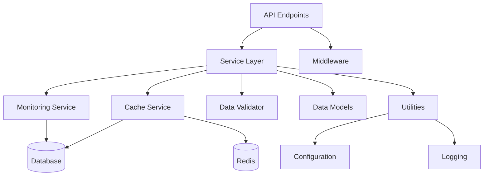

# Component Documentation

## Overview

This document provides detailed information about each major component in the AliExpress Affiliate API Service, including their responsibilities, interfaces, and implementation details.

## Component Hierarchy

```
Application
├── API Layer
│   ├── FastAPI Application
│   ├── Endpoints
│   └── Middleware Stack
├── Service Layer
│   ├── AliExpress Service
│   ├── Cache Service
│   ├── Monitoring Service
│   └── Data Validator
├── Data Layer
│   ├── Models
│   └── Validators
└── Utility Layer
    ├── Configuration
    ├── Logging
    └── Response Formatter
```

## API Layer Components

### FastAPI Application (`src/api/main.py`)

**Purpose**: Main application entry point and configuration

**Key Responsibilities**:
- Application initialization
- Middleware registration
- Router registration
- CORS configuration
- Exception handler registration
- OpenAPI documentation generation

**Configuration**:
```python
app = FastAPI(
    title="AliExpress Affiliate API Service",
    version="2.0.0",
    description="Production-ready AliExpress Affiliate API",
    docs_url="/docs",
    redoc_url="/redoc",
    openapi_url="/openapi.json"
)
```

**Middleware Stack** (execution order):
1. Request ID Middleware
2. Security Headers Middleware
3. Rate Limiter Middleware
4. CORS Middleware
5. Audit Logger Middleware

### Endpoints

#### Products Endpoint (`src/api/endpoints/products.py`)

**Routes**:
- `POST /api/products/search` - Search products
- `POST /api/products` - Advanced product search
- `POST /api/products/details` - Get product details
- `POST /api/products/hot` - Get hot products
- `POST /api/products/image-search` - Search by image

**Dependencies**:
- AliExpressService
- CacheService
- DataValidator

**Example**:
```python
@router.post("/search")
async def search_products(
    request: ProductSearchRequest,
    service: AliExpressService = Depends(get_aliexpress_service)
) -> ServiceResponse:
    """Search for products with keywords and filters."""
    result = await service.search_products(
        keywords=request.keywords,
        page_size=request.page_size,
        sort=request.sort
    )
    return ServiceResponse(success=True, data=result)
```

#### Categories Endpoint (`src/api/endpoints/categories.py`)

**Routes**:
- `GET /api/categories` - Get parent categories
- `GET /api/categories/{parent_id}/children` - Get child categories

**Caching**: Aggressive (24-hour TTL)

#### Affiliate Endpoint (`src/api/endpoints/affiliate.py`)

**Routes**:
- `POST /api/affiliate/links` - Generate affiliate links (batch)
- `GET /api/affiliate/link` - Generate single affiliate link

**Rate Limiting**: Stricter limits (30/min)

#### Health Endpoint (`src/api/endpoints/health.py`)

**Routes**:
- `GET /health` - Basic health check
- `GET /system/info` - System information
- `GET /api/cache/stats` - Cache statistics

**Purpose**: Monitoring and diagnostics

#### Admin Endpoint (`src/api/endpoints/admin.py`)

**Routes**:
- `GET /admin/dashboard` - Admin dashboard
- `POST /admin/cache/clear` - Clear cache
- `GET /admin/metrics` - System metrics

**Authentication**: Requires admin API key

## Middleware Components

### Rate Limiter (`src/middleware/rate_limiter.py`)

**Algorithm**: Token Bucket + Sliding Window

**Configuration**:
```python
RateLimitConfig(
    requests_per_minute=60,
    requests_per_second=5,
    burst_size=10
)
```

**Features**:
- Per-IP rate limiting
- Configurable limits per endpoint
- Automatic cleanup of expired entries
- Retry-After header in responses

**Implementation**:
```python
class EnhancedRateLimiter:
    def __init__(self, config: RateLimitConfig):
        self.token_buckets: Dict[str, TokenBucket] = {}
        self.sliding_windows: Dict[str, SlidingWindowCounter] = {}
    
    def is_allowed(self, client_id: str) -> bool:
        """Check if request is allowed."""
        # Check per-second limit (token bucket)
        if not self._check_token_bucket(client_id):
            return False
        
        # Check per-minute limit (sliding window)
        if not self._check_sliding_window(client_id):
            return False
        
        return True
```

### Security Headers (`src/middleware/security_headers.py`)

**Headers Applied**:
```python
headers = {
    "X-Content-Type-Options": "nosniff",
    "X-Frame-Options": "DENY",
    "X-XSS-Protection": "1; mode=block",
    "Strict-Transport-Security": "max-age=31536000; includeSubDomains",
    "Content-Security-Policy": "default-src 'self'",
    "Referrer-Policy": "strict-origin-when-cross-origin"
}
```

**Purpose**: Protect against common web vulnerabilities

### Request ID (`src/middleware/request_id.py`)

**Purpose**: Generate unique ID for each request

**Features**:
- UUID v4 generation
- Propagate through logging context
- Include in response headers
- Enable request tracing

**Implementation**:
```python
async def dispatch(self, request: Request, call_next):
    request_id = str(uuid.uuid4())
    request.state.request_id = request_id
    
    # Add to logging context
    structlog.contextvars.bind_contextvars(request_id=request_id)
    
    response = await call_next(request)
    response.headers["X-Request-ID"] = request_id
    
    return response
```

## Service Layer Components

### AliExpress Service (`src/services/aliexpress_service.py`)

**Purpose**: High-level wrapper for AliExpress API operations

**Key Methods**:
```python
class AliExpressService:
    async def get_parent_categories(self) -> List[CategoryResponse]
    async def get_child_categories(self, parent_id: str) -> List[CategoryResponse]
    async def search_products(self, **kwargs) -> ProductSearchResponse
    async def get_products_details(self, product_ids: List[str]) -> List[ProductResponse]
    async def get_affiliate_links(self, urls: List[str]) -> List[AffiliateLink]
    async def get_hot_products(self, **kwargs) -> List[ProductResponse]
```

**Features**:
- Automatic retry with exponential backoff
- Response caching
- Error handling and transformation
- Request validation
- Performance logging

**Error Handling**:
```python
try:
    result = await self._call_api(request)
except Exception as e:
    if "rate limit" in str(e).lower():
        raise RateLimitError("Rate limit exceeded", retry_after=60)
    elif "permission" in str(e).lower():
        raise PermanentError("Permission denied")
    else:
        raise TransientError(f"API call failed: {str(e)}")
```

### Cache Service (`src/services/cache_service.py`)

**Purpose**: Multi-level caching implementation

**Cache Levels**:
1. **Memory Cache**: In-process, fastest
2. **Redis Cache**: Distributed, shared (optional)
3. **Database Cache**: Persistent, SQLite

**Key Methods**:
```python
class CacheService:
    async def get(self, key: str) -> Optional[Any]
    async def set(self, key: str, value: Any, ttl: int)
    async def delete(self, key: str)
    async def clear(self, pattern: str = "*")
    async def get_stats(self) -> CacheStats
```

**Cache Strategy**:
```python
async def get(self, key: str) -> Optional[Any]:
    # Try memory cache first
    if value := self.memory_cache.get(key):
        return value
    
    # Try Redis cache
    if self.redis and (value := await self.redis.get(key)):
        self.memory_cache.set(key, value)
        return value
    
    # Try database cache
    if value := await self.db_cache.get(key):
        if self.redis:
            await self.redis.set(key, value)
        self.memory_cache.set(key, value)
        return value
    
    return None
```

### Monitoring Service (`src/services/monitoring_service.py`)

**Purpose**: Collect and expose system metrics

**Metrics Tracked**:
- Request count and latency
- Error rates by type
- Cache hit/miss rates
- Rate limit violations
- API call success/failure rates
- Memory and CPU usage

**Key Methods**:
```python
class MonitoringService:
    def record_request(self, endpoint: str, method: str, status: int, duration: float)
    def record_cache_hit(self, cache_type: str)
    def record_cache_miss(self, cache_type: str)
    def record_api_call(self, success: bool, duration: float)
    def get_metrics(self) -> Dict[str, Any]
```

**Metrics Endpoint**:
```python
@router.get("/metrics")
async def get_metrics(
    monitoring: MonitoringService = Depends(get_monitoring_service)
) -> Dict[str, Any]:
    return monitoring.get_metrics()
```

### Data Validator (`src/services/data_validator.py`)

**Purpose**: Business rule validation

**Validation Rules**:
```python
class DataValidator:
    def validate_search_params(self, params: Dict) -> ValidationResult:
        """Validate product search parameters."""
        errors = []
        
        if not params.get("keywords"):
            errors.append("Keywords are required")
        
        if len(params.get("keywords", "")) > 200:
            errors.append("Keywords too long (max 200 chars)")
        
        if params.get("page_size", 0) > 50:
            errors.append("Page size too large (max 50)")
        
        return ValidationResult(valid=len(errors) == 0, errors=errors)
```

## Data Layer Components

### Response Models (`src/models/responses.py`)

**Purpose**: Pydantic models for API responses

**Key Models**:
```python
class ProductResponse(BaseModel):
    product_id: str
    product_title: str
    price: float
    original_price: Optional[float]
    discount_percentage: Optional[float]
    rating: Optional[float]
    order_count: Optional[int]
    product_url: str
    image_url: Optional[str]

class CategoryResponse(BaseModel):
    category_id: str
    category_name: str
    parent_category_id: Optional[str]

class AffiliateLink(BaseModel):
    original_url: str
    affiliate_url: str
    tracking_id: str
    commission_rate: Optional[float]

class ServiceResponse(BaseModel):
    success: bool
    data: Optional[Any]
    error: Optional[Dict[str, Any]]
    metadata: Dict[str, Any]
```

### Cache Models (`src/models/cache_models.py`)

**Purpose**: Models for cache entries

```python
class CacheEntry(BaseModel):
    key: str
    value: Any
    created_at: datetime
    expires_at: datetime
    hit_count: int = 0

class CacheStats(BaseModel):
    total_entries: int
    memory_usage_mb: float
    hit_rate: float
    miss_rate: float
    avg_ttl_seconds: float
```

## Utility Layer Components

### Configuration (`src/utils/config.py`)

**Purpose**: Environment-based configuration management

**Implementation**:
```python
class Config(BaseSettings):
    # AliExpress API
    aliexpress_app_key: str
    aliexpress_app_secret: str
    aliexpress_tracking_id: str = "default"
    
    # API Server
    api_host: str = "0.0.0.0"
    api_port: int = 8000
    
    # Security
    admin_api_key: Optional[str] = None
    allowed_origins: List[str] = ["https://chat.openai.com"]
    
    # Rate Limiting
    rate_limit_per_minute: int = 60
    rate_limit_per_second: int = 5
    
    # Caching
    cache_enabled: bool = True
    cache_ttl_seconds: int = 3600
    redis_url: Optional[str] = None
    
    class Config:
        env_file = ".env"
        case_sensitive = False
```

### Logging Configuration (`src/utils/logging_config.py`)

**Purpose**: Structured logging setup

**Features**:
- JSON output for production
- Console output for development
- Request ID in all logs
- Performance timing
- Error stack traces

**Setup**:
```python
def setup_logging(log_level: str = "INFO", log_format: str = "json"):
    structlog.configure(
        processors=[
            structlog.contextvars.merge_contextvars,
            structlog.stdlib.add_log_level,
            structlog.processors.TimeStamper(fmt="iso"),
            structlog.processors.JSONRenderer()
        ],
        logger_factory=structlog.stdlib.LoggerFactory(),
    )
```

### Response Formatter (`src/utils/response_formatter.py`)

**Purpose**: Consistent response formatting

**Methods**:
```python
class ResponseFormatter:
    @staticmethod
    def success(data: Any, metadata: Dict = None) -> ServiceResponse:
        return ServiceResponse(
            success=True,
            data=data,
            metadata=metadata or {}
        )
    
    @staticmethod
    def error(message: str, code: str, details: Dict = None) -> ServiceResponse:
        return ServiceResponse(
            success=False,
            error={
                "code": code,
                "message": message,
                "details": details or {}
            }
        )
```

## Component Dependencies



## Component Communication

### Synchronous Communication
- API → Service: Direct method calls
- Service → Cache: Direct method calls
- Service → Validator: Direct method calls

### Asynchronous Communication
- API → External API: HTTP requests
- Service → AliExpress API: HTTP requests
- Cache → Redis: Network calls

### Event-Based Communication
- Monitoring: Metrics collection via events
- Logging: Structured log events
- Audit: Request/response logging

## Component Testing

### Unit Testing
Each component has dedicated unit tests:
- `tests/unit/api/` - API endpoint tests
- `tests/unit/services/` - Service layer tests
- `tests/unit/middleware/` - Middleware tests
- `tests/unit/models/` - Model validation tests
- `tests/unit/utils/` - Utility function tests

### Integration Testing
- `tests/integration/` - Cross-component tests
- API endpoint integration tests
- Cache integration tests
- Full workflow tests

## Related Documentation

- [Architecture Overview](overview.md) - High-level system architecture
- [Data Flow](data-flow.md) - Request/response flow diagrams
- [API Documentation](../api/) - API endpoint reference
- [Development Guide](../development/) - Development guidelines

---

*Last Updated: December 4, 2025*
