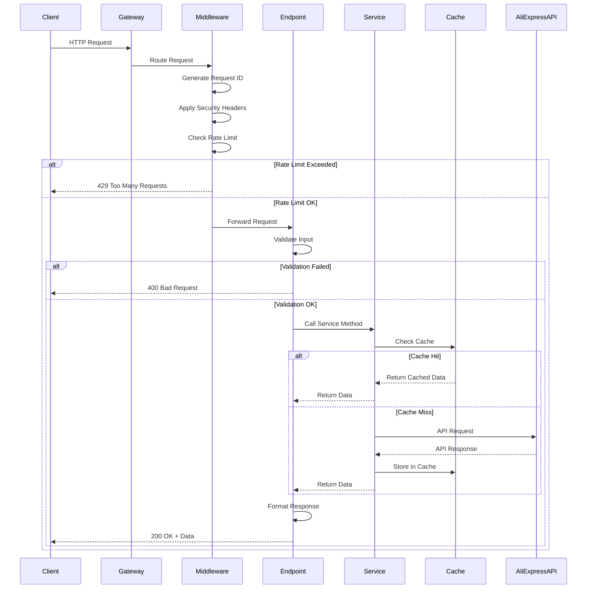
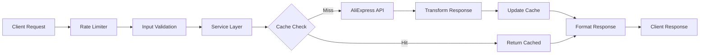
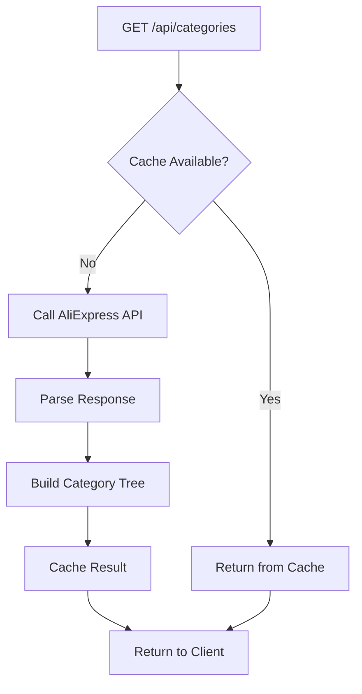
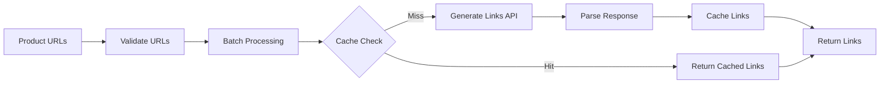
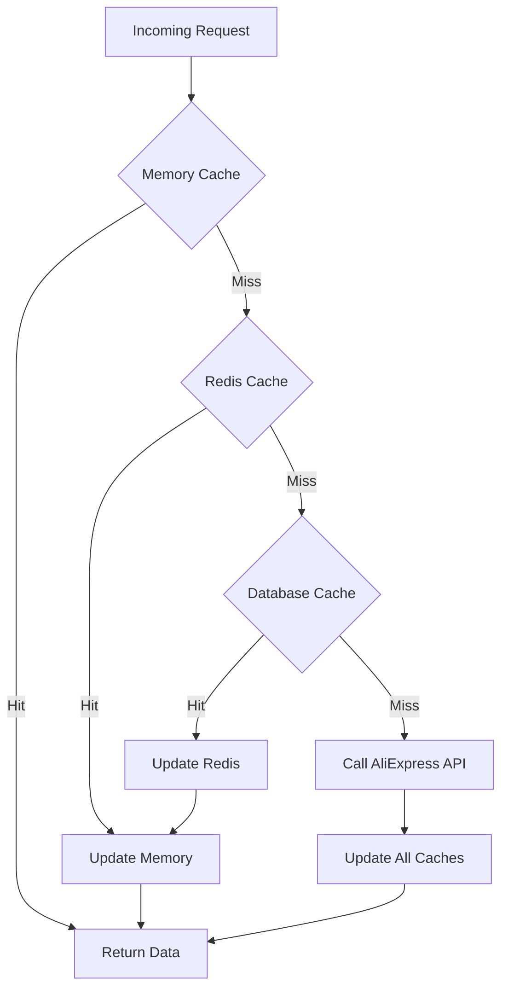
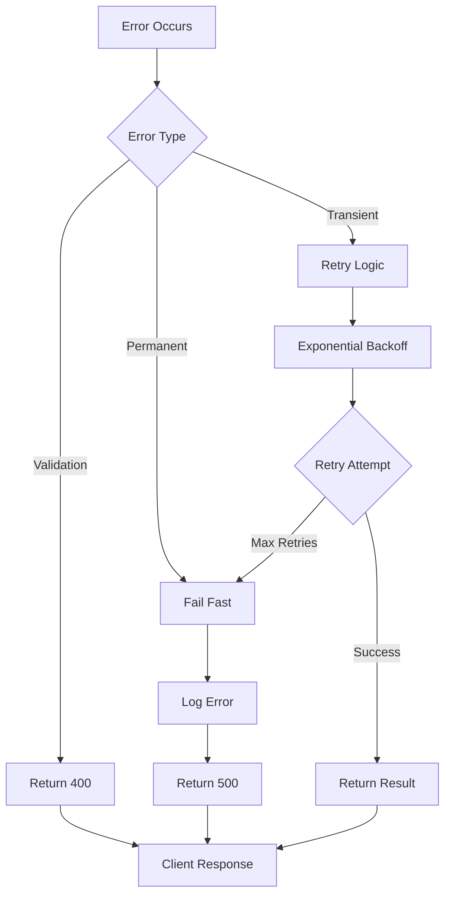
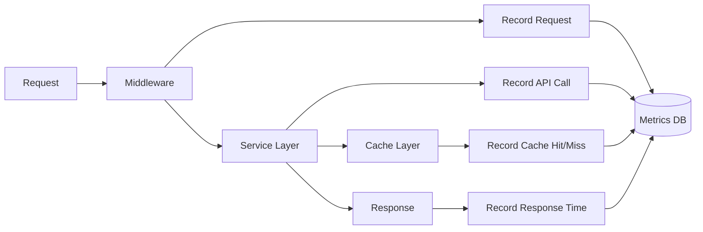
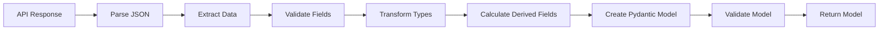
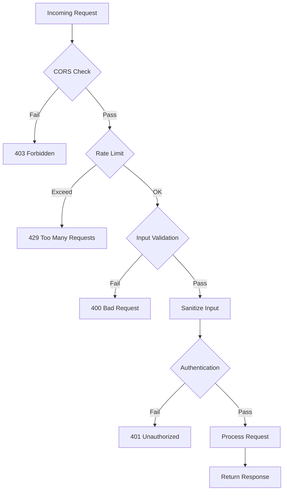

# Data Flow Architecture

## Overview

This document describes how data flows through the AliExpress Affiliate API Service, from initial request to final response. Understanding these flows is essential for debugging, optimization, and extending the system.

## Request/Response Flow

### Standard API Request Flow



## Detailed Flow Descriptions

### 1. Product Search Flow

**Endpoint**: `POST /api/products/search`



**Steps**:
1. **Request Reception**: FastAPI receives POST request
2. **Middleware Processing**:
   - Generate unique request ID
   - Apply security headers
   - Check rate limits (60/min, 5/sec)
3. **Input Validation**:
   - Validate keywords (required, max 200 chars)
   - Validate page_size (1-50)
   - Validate price ranges
   - Sanitize search query
4. **Cache Lookup**:
   - Generate cache key from parameters
   - Check memory cache (fastest)
   - Check Redis cache (if configured)
   - Check database cache (persistent)
5. **API Call** (if cache miss):
   - Build AliExpress API request
   - Add authentication signature
   - Execute HTTP request with retry logic
   - Handle API errors
6. **Response Transformation**:
   - Parse API response
   - Transform to internal models
   - Validate response data
   - Calculate additional fields
7. **Cache Update**:
   - Store in memory cache (TTL: 30 min)
   - Store in Redis (TTL: 1 hour)
   - Store in database (TTL: 24 hours)
8. **Response Formatting**:
   - Wrap in ServiceResponse model
   - Add metadata (processing time, cache status)
   - Serialize to JSON
9. **Response Delivery**:
   - Add response headers
   - Return to client

### 2. Category Retrieval Flow

**Endpoint**: `GET /api/categories`



**Caching Strategy**:
- Categories change infrequently
- Long TTL: 24 hours in memory, 7 days in database
- Aggressive caching reduces API calls

### 3. Affiliate Link Generation Flow

**Endpoint**: `POST /api/affiliate/links`



**Batch Processing**:
- Maximum 20 URLs per request
- Parallel cache lookups
- Single API call for all uncached URLs
- Individual error handling per URL

## Caching Architecture

### Multi-Level Cache Strategy



### Cache Key Generation

```python
def generate_cache_key(operation: str, params: dict) -> str:
    """
    Generate deterministic cache key from operation and parameters.
    
    Example:
        operation = "product_search"
        params = {"keywords": "phone", "page_size": 10}
        key = "product_search:keywords=phone:page_size=10"
    """
    sorted_params = sorted(params.items())
    param_str = ":".join(f"{k}={v}" for k, v in sorted_params)
    return f"{operation}:{param_str}"
```

### Cache TTL Strategy

| Data Type | Memory TTL | Redis TTL | Database TTL | Rationale |
|-----------|-----------|-----------|--------------|-----------|
| Categories | 24 hours | 7 days | 30 days | Rarely changes |
| Products | 30 minutes | 1 hour | 24 hours | Prices change frequently |
| Affiliate Links | 2 hours | 6 hours | 7 days | Stable once generated |
| Hot Products | 15 minutes | 30 minutes | 2 hours | Very dynamic |

## Error Handling Flow

### Error Classification and Handling



### Error Response Format

```json
{
  "success": false,
  "error": {
    "code": "RATE_LIMIT_EXCEEDED",
    "message": "Rate limit exceeded. Please try again later.",
    "details": {
      "retry_after": 60,
      "limit": "60 requests per minute"
    }
  },
  "metadata": {
    "request_id": "req_abc123",
    "timestamp": "2025-12-04T10:30:00Z"
  }
}
```

## Monitoring Data Flow

### Metrics Collection



### Logged Events

1. **Request Events**:
   - Request received (method, path, IP)
   - Request ID assigned
   - Rate limit check result

2. **Processing Events**:
   - Input validation result
   - Cache lookup result
   - API call initiated
   - API call completed

3. **Response Events**:
   - Response prepared
   - Response sent
   - Total processing time

4. **Error Events**:
   - Error type and message
   - Stack trace
   - Request context

## Performance Optimization

### Request Optimization Strategies

1. **Parallel Processing**:
   ```python
   # Fetch multiple products in parallel
   async def get_multiple_products(product_ids: List[str]):
       tasks = [get_product(id) for id in product_ids]
       return await asyncio.gather(*tasks)
   ```

2. **Connection Pooling**:
   - Reuse HTTP connections to AliExpress API
   - Database connection pool (10 connections)
   - Redis connection pool (if used)

3. **Response Compression**:
   - GZip compression for responses > 1KB
   - Reduces bandwidth by 60-80%

4. **Lazy Loading**:
   - Load detailed data only when requested
   - Paginate large result sets

### Cache Warming

```python
# Warm cache with popular categories on startup
async def warm_cache():
    """Pre-populate cache with frequently accessed data."""
    await cache_service.get_categories()  # Cache all categories
    await cache_service.get_hot_products()  # Cache trending products
```

## Data Transformation Pipeline

### AliExpress API Response → Internal Model



**Example Transformation**:
```python
# AliExpress API Response
{
  "app_sale_price": "2999",  # Price in cents
  "original_price": "5999",
  "evaluate_rate": "98.5%"
}

# Transformed Internal Model
ProductResponse(
    price=29.99,  # Converted to dollars
    original_price=59.99,
    discount_percentage=50.0,  # Calculated
    rating=4.9,  # Converted from percentage
    rating_percentage=98.5
)
```

## Security Data Flow

### Request Security Pipeline



### Data Sanitization

```python
def sanitize_search_query(query: str) -> str:
    """Remove potentially dangerous characters from search query."""
    # Remove SQL injection attempts
    query = re.sub(r'[<>\"\'%;()&+]', '', query)
    # Limit length
    query = query[:200]
    # Trim whitespace
    return query.strip()
```

## Related Documentation

- [Architecture Overview](overview.md) - High-level system architecture
- [Components](components.md) - Detailed component documentation
- [API Documentation](../api/) - API endpoint reference
- [Operations Guide](../operations/) - Monitoring and troubleshooting

---

*Last Updated: December 4, 2025*
