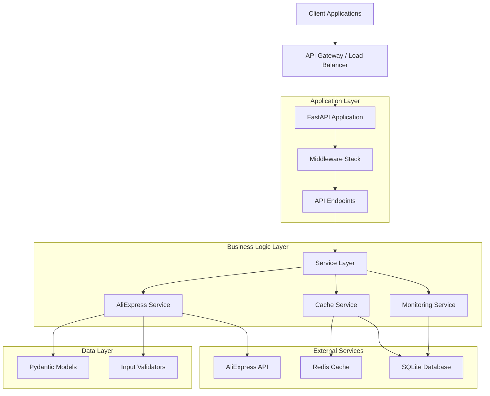

# System Architecture Overview

## Introduction

The AliExpress Affiliate API Service is built with a modern, layered architecture that emphasizes separation of concerns, maintainability, and scalability. This document provides a high-level overview of the system architecture and design principles.

## Architecture Diagram



## Architectural Layers

### 1. API Layer (FastAPI)

**Purpose**: Handle HTTP requests, routing, and response formatting

**Components**:
- **FastAPI Application** (`src/api/main.py`): Main application entry point
- **Endpoints** (`src/api/endpoints/`): Route handlers organized by domain
  - `products.py`: Product search and details
  - `categories.py`: Category management
  - `affiliate.py`: Affiliate link generation
  - `health.py`: Health checks and monitoring
  - `admin.py`: Administrative endpoints

**Responsibilities**:
- Request routing and validation
- Response serialization
- OpenAPI documentation generation
- CORS handling
- Error response formatting

### 2. Middleware Layer

**Purpose**: Cross-cutting concerns applied to all requests

**Components**:
- **Rate Limiter** (`src/middleware/rate_limiter.py`): Token bucket algorithm
- **Security Headers** (`src/middleware/security_headers.py`): CSP, HSTS, etc.
- **Request ID** (`src/middleware/request_id.py`): Request tracking
- **Audit Logger** (`src/middleware/audit_logger.py`): Request/response logging
- **CSRF Protection** (`src/middleware/csrf.py`): CSRF token validation
- **JWT Auth** (`src/middleware/jwt_auth.py`): Authentication (optional)

**Execution Order**:
1. Request ID generation
2. Security headers
3. Rate limiting
4. CSRF protection (if enabled)
5. JWT authentication (if enabled)
6. Audit logging
7. Request processing
8. Response logging

### 3. Service Layer

**Purpose**: Business logic and external API integration

**Components**:
- **AliExpress Service** (`src/services/aliexpress_service.py`): High-level API wrapper
- **Enhanced AliExpress Service** (`src/services/enhanced_aliexpress_service.py`): Advanced features
- **Cache Service** (`src/services/cache_service.py`): Multi-level caching
- **Monitoring Service** (`src/services/monitoring_service.py`): Metrics collection
- **Data Validator** (`src/services/data_validator.py`): Business rule validation
- **Image Processing Service** (`src/services/image_processing_service.py`): Image analysis

**AliExpress SDK Modules** (`src/services/aliexpress/`):
- 11 Affiliate API modules
- 3 Dropshipping API modules
- 2 Solution API modules
- Service factory for easy instantiation

**Responsibilities**:
- AliExpress API communication
- Response transformation
- Error handling and retry logic
- Caching strategy implementation
- Business rule enforcement

### 4. Data Layer

**Purpose**: Data models and validation

**Components**:
- **Response Models** (`src/models/responses.py`): API response structures
- **Cache Models** (`src/models/cache_models.py`): Cache entry structures
- **Request Models**: Pydantic models for request validation

**Responsibilities**:
- Data validation
- Type safety
- Serialization/deserialization
- Schema documentation

### 5. Utility Layer

**Purpose**: Shared utilities and helpers

**Components**:
- **Configuration** (`src/utils/config.py`): Environment-based configuration
- **Logging** (`src/utils/logging_config.py`): Structured logging setup
- **Response Formatter** (`src/utils/response_formatter.py`): Consistent responses
- **Validators** (`src/utils/validators.py`): Input sanitization
- **API Signature** (`src/utils/api_signature.py`): AliExpress signature generation

## Design Principles

### 1. Separation of Concerns

Each layer has a single, well-defined responsibility:
- **API Layer**: HTTP protocol handling
- **Service Layer**: Business logic
- **Data Layer**: Data structures and validation
- **Utility Layer**: Shared functionality

### 2. Dependency Injection

Services receive their dependencies through constructor injection:
```python
class AliExpressService:
    def __init__(self, config: Config, cache_service: CacheService):
        self.config = config
        self.cache = cache_service
```

### 3. Type Safety

100% type annotation coverage ensures:
- Compile-time error detection
- Better IDE support
- Self-documenting code
- Reduced runtime errors

### 4. Error Handling

Standardized exception hierarchy:
```
AliExpressServiceException (base)
├── ConfigurationError
├── APIError
│   ├── TransientError (retryable)
│   │   └── RateLimitError
│   └── PermanentError (non-retryable)
├── ValidationError
└── CacheError
```

### 5. Observability

Comprehensive logging and monitoring:
- Structured logging with request IDs
- Performance metrics collection
- Health check endpoints
- Cache statistics
- Rate limit monitoring

## Technology Stack

### Core Framework
- **FastAPI**: Modern, fast web framework
- **Pydantic**: Data validation and settings management
- **Uvicorn**: ASGI server

### Data Storage
- **SQLite**: Local database for caching and audit logs
- **Redis** (optional): Distributed caching

### External APIs
- **AliExpress API**: Official affiliate API
- **python-aliexpress-api**: Official Python SDK

### Development Tools
- **pytest**: Testing framework
- **mypy**: Static type checking
- **ruff**: Fast Python linter
- **black**: Code formatting

## Deployment Architecture

### Vercel (Serverless)
```
Client Request
    ↓
Vercel Edge Network
    ↓
Serverless Function (Python 3.11)
    ↓
FastAPI Application
    ↓
AliExpress API
```

**Characteristics**:
- Auto-scaling
- Global CDN
- 10-second timeout
- Stateless execution

### Render (Traditional)
```
Client Request
    ↓
Render Load Balancer
    ↓
Gunicorn (Process Manager)
    ↓
Uvicorn Workers (4x)
    ↓
FastAPI Application
    ↓
AliExpress API
```

**Characteristics**:
- Persistent processes
- No timeout limits
- Disk storage
- WebSocket support

## Scalability Considerations

### Horizontal Scaling
- Stateless design enables easy horizontal scaling
- No session state stored in application
- Cache can be distributed (Redis)

### Vertical Scaling
- Efficient resource usage
- Async/await for I/O operations
- Connection pooling for databases

### Caching Strategy
Multi-level caching reduces API calls:
1. **Memory Cache**: Fast, in-process (TTL: 5-30 minutes)
2. **Redis Cache**: Distributed, shared (TTL: 1-24 hours)
3. **Database Cache**: Persistent, long-term (TTL: 1-7 days)

## Security Architecture

### Defense in Depth

1. **Network Layer**: HTTPS only, CORS restrictions
2. **Application Layer**: Rate limiting, input validation
3. **Data Layer**: SQL injection prevention, XSS protection
4. **Monitoring Layer**: Audit logging, anomaly detection

### Authentication & Authorization

- **Public Endpoints**: No authentication required
- **Admin Endpoints**: API key authentication
- **Internal Endpoints**: Internal API key

### Data Protection

- No sensitive data stored
- API credentials in environment variables
- Secure headers (CSP, HSTS, X-Frame-Options)
- Input sanitization on all endpoints

## Performance Characteristics

### Response Times
- **Cached Requests**: 10-50ms
- **Uncached Requests**: 500-2000ms (depends on AliExpress API)
- **Database Queries**: 1-10ms

### Throughput
- **Rate Limit**: 60 requests/minute per IP
- **Burst Capacity**: 5 requests/second
- **Concurrent Requests**: Limited by deployment platform

### Resource Usage
- **Memory**: ~50-100MB per worker
- **CPU**: Low (I/O bound)
- **Disk**: Minimal (SQLite databases)

## Monitoring & Observability

### Health Checks
- `/health`: Basic health check
- `/system/info`: System information
- `/api/cache/stats`: Cache statistics

### Metrics Collected
- Request count and latency
- Error rates by type
- Cache hit/miss rates
- Rate limit violations
- API call success/failure rates

### Logging
- Structured JSON logging
- Request ID tracking
- Performance timing
- Error stack traces
- Audit trail

## Future Enhancements

### Planned Improvements
1. **GraphQL API**: Alternative to REST
2. **WebSocket Support**: Real-time updates
3. **Advanced Caching**: Predictive cache warming
4. **Machine Learning**: Product recommendations
5. **Multi-region Deployment**: Reduced latency

### Scalability Roadmap
1. **Phase 1**: Current (single region, SQLite)
2. **Phase 2**: Redis caching, multi-region
3. **Phase 3**: Microservices, event-driven
4. **Phase 4**: ML-powered features

## Related Documentation

- [Data Flow](data-flow.md) - Request/response flow diagrams
- [Components](components.md) - Detailed component documentation
- [API Documentation](../api/) - API endpoint reference
- [Deployment Guides](../deployment/) - Platform-specific deployment

---

*Last Updated: December 4, 2025*
